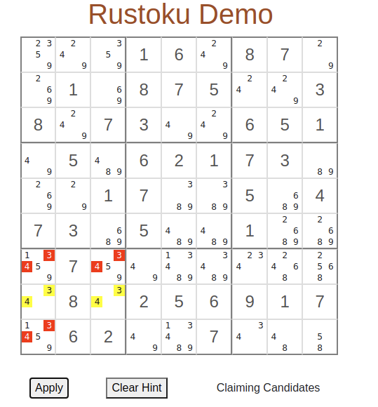
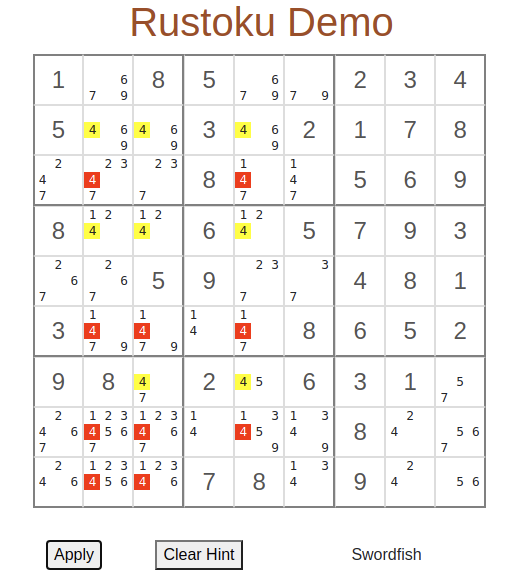

<div align="center">

  <h1><code>Rustoku Example App</code></h1>

  <strong>A basic app demonstrating the human solve techniques of <a href="https://github.com/timlikestacos/rustoku">Rustoku</a>.</strong>

</div>

## About

A basic development web server that hosts runs a puzzle using the Rustoku library.  The app uses JavaScript to update HTML elements,
and uses WASM to interface Rust code with JavaScript.

CSS stylesheet used under the MIT license from the <a href="https://github.com/pocketjoso/sudokuJS">SudokuJS repo</a> by Jonas Ohlsson.

At this point, it only supports clicking on the `hint` and `apply` button to solve the puzzle.  No actions for entering values, manual elimination of candidates,
 and no checks for valid inputs.  This is a demonstration only.

Different puzzles can be used by entering the string in the input box below the puzzle grid.  Use periods for blank spaces.  Must have 81 characters, if the puzzle does not update
when `Create Puzzle` is clicked, then there is an error in the input string (incorrect number of characters likely).  This app will allow invalid puzzles. The Rustoku library checks these
and returns a `Result`, however this app ignores errors (again, this is just a demo). 

##  Usage

### Install and build wasm-pack
Directions to install are <a href="https://github.com/rustwasm/wasm-pack">here</a>.  
In the root directory, build the wasm files by running:
```
wasm-pack build
```
###  Requires NPM

Start the development server by:
```
cd www
npm install
npm run start
```

Open `localhost:8080` in your browser.

## Screenshots

  
  





